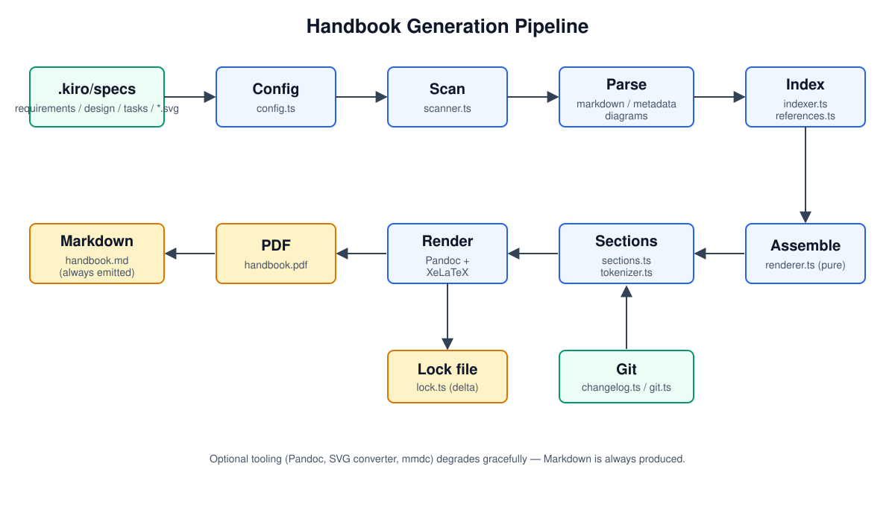

# Design

## Overview

Handbook generation is a linear pipeline of small, mostly-pure modules. Data
flows from spec files on disk into a typed in-memory model, then into assembled
Markdown, and finally into a PDF via Pandoc/XeLaTeX. IO is kept at the edges so
the assembly logic can be unit-tested in isolation.

## Architecture

The pipeline stages and their supporting modules are shown below.

Stages:

1. **Config** (`config.ts`) loads and normalises `handbook.yml`, locating the
   repository root (nearest ancestor containing `.kiro`) and the tool root
   (which ships the LaTeX template).
2. **Scan** (`scanner.ts`) discovers spec directories, reads each document,
   classifies it, and computes a deterministic SHA-256 content hash across all
   source files.
3. **Parse** (`markdown.ts`, `metadata.ts`, `diagrams.ts`) extracts requirements,
   tasks, front matter, stable ids, and SVG diagram references.
4. **Index** (`indexer.ts`, `references.ts`) builds the indexes, assigns figure
   numbers, and wires cross-reference anchors and hyperlinks.
5. **Assemble** (`renderer.ts` → `assembleMarkdown`) concatenates every section
   in a fixed order, separated by LaTeX page breaks. This function is pure.
6. **Render** (`renderer.ts` → `render`) prepares diagram assets, resolves
   steering file includes, writes the Markdown, and invokes Pandoc when present.
7. **Lock** (`lock.ts`) writes `handbook.lock.json` for delta detection on the
   next build.

## Components and Interfaces

- `scanSpecs(config): Promise<Spec[]>` — discovery + parsing, returns specs
  sorted by id.
- `assembleMarkdown(handbook, config, parts, images, mermaidImages): string` —
  pure assembly of the final Markdown.
- `render(handbook, config, parts): Promise<RenderResult>` — full pipeline with
  IO and Pandoc invocation.

The `HandbookParts` interface carries pre-rendered Markdown fragments (document
info, indexes, steering, traceability, appendices) injected into the assembler
in order.

## Data Model

The central types are `Spec` (id, slug, title, version, status, documents,
requirements, tasks, diagrams, references, contentHash) and `Handbook` (specs,
buildDate, revision). See `src/types.ts`.

## Error Handling

Missing optional tooling never fails the build: the renderer detects Pandoc, an
SVG converter, and `mmdc`, and falls back to Markdown, referenced diagrams, or
fenced mermaid code respectively. Validation errors (broken references, bad
metadata) are surfaced by the `validate` command and can block `build`.

## Testing Strategy

`assembleMarkdown`, id derivation, markdown parsing, indexing, references, and
lock/delta logic are unit-tested. An integration test drives `scanSpecs` over a
temporary fixture spec tree.
