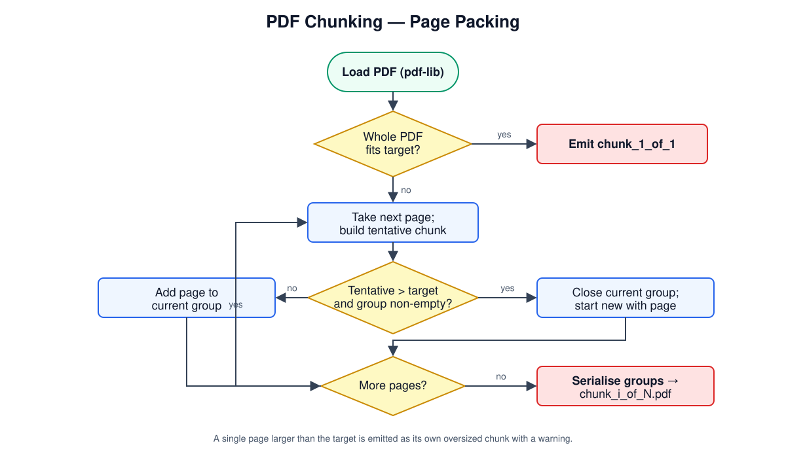

# Design

## Overview

`pdf-chunker.ts` reads a PDF with `pdf-lib` and greedily groups pages into chunks
that each stay at or under a target size. Every chunk is rebuilt as a new
`PDFDocument`, so the output is always a valid, standalone PDF.

## Algorithm

1. Read the input file and load it with `pdf-lib` (`ignoreEncryption: true`).
2. If the whole file already fits the target, re-save it as `_chunk_1_of_1`.
3. Otherwise, iterate pages, maintaining a `current` group:
   - Estimate the single-page size as an upper bound.
   - Build a tentative chunk from `current + page` and measure its real
     serialised size (copied objects like fonts/images can be shared, so the
     real size is often smaller than the naive sum).
   - If the tentative size overshoots and `current` is non-empty, close the
     current group and start a new one with this page.
   - If a single page alone exceeds the target, emit it as its own oversized
     chunk with a warning.
4. Serialise each group to `<name>_chunk_<i>_of_<N>.pdf` (unless dry-run).

Measuring the real serialised size after each addition — rather than summing
per-page estimates — is what keeps chunks close to, but under, the target.

## Interfaces

- `chunkPdf(options: ChunkOptions): Promise<ChunkResult>` — the splitter.
- `suggestChunkSize(bytes): 1 | 2 | 3 | 4` — auto-size heuristic (prefers 4 MB
  to minimise uploads).
- `isValidChunkSize(size): boolean` — guards CLI input.

`ChunkResult` reports total size, chosen chunk size, count, and per-chunk path,
byte size, human size, and page count.

## CLI

Exposed as `handbook chunk` and the standalone `pdf-chunker` binary, with
`--input`, `--size`, `--output`, `--dry-run`, and `--auto-size` flags. Paths are
resolved relative to the repository root.

## Testing Strategy

Tests assert that chunks are valid parseable PDFs, that pages are preserved and
ordered across chunks, that sizes stay within target where pages allow, that
naming includes the total count, and that dry-run writes nothing.
