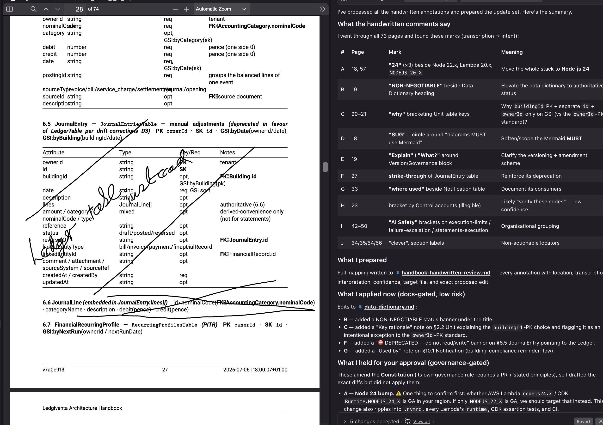

# kiro-spec-handbook

Convert AWS Kiro specifications into a professionally formatted PDF handbook for review, annotation, and printing.

**The workflow:** Write specs → Generate PDF → Annotate on tablet (reMarkable, iPad, etc.) → Process notes back into project.

## Why

Specification work requires review and collaboration. This tool lets you:

- **Print & review** specifications as a polished, indexed PDF handbook
- **Annotate on tablets** like reMarkable with handwritten notes and feedback
- **Process annotations** back into your project (future integration with Claude/Opus)
- **Archive versions** as deterministic builds, suitable for CI/CD
- **Share with stakeholders** who prefer reading from paper or tablets

## Features

- 📄 Indexed PDF handbook from Kiro specifications (requirements, tasks, diagrams)
- 🎨 SVG diagram embedding and Mermaid diagram rendering
- 📑 Cross-referenced architecture overview, requirements, tasks, and diagram indexes
- 🔐 Deterministic builds for CI/CD and version control
- 🎯 Stable identifiers for specs, requirements, and tasks
- 📊 Traceability matrix and revision history
- 💾 Change detection via lock file (know what changed since last build)
- 📦 PDF chunking for Kiro uploads (respects 4MB attachment limit)

## Install

### From GitHub Packages

Authenticate with GitHub Packages first (required for private packages):

```bash
# Create a Personal Access Token at https://github.com/settings/tokens
# with read:packages and write:packages scopes
# Then configure npm:

echo "@just-ak:registry=https://npm.pkg.github.com" >> ~/.npmrc
echo "//npm.pkg.github.com/:_authToken=YOUR_TOKEN" >> ~/.npmrc
```

Then install:

```bash
npm install @just-ak/kiro-spec-handbook
```

### System Dependencies

To generate PDFs, you'll also need:

**macOS:**

```bash
brew install pandoc librsvg xelatex
```

Or use TinyTeX (lighter, 100MB vs 5GB):

```bash
curl -sL https://yihui.org/tinytex/install-bin-unix.sh | sh
```

**Ubuntu/Debian:**

```bash
apt-get install pandoc librsvg2-bin texlive-xetex texlive-fonts-recommended
```

**Without system dependencies:** The tool still runs and outputs Markdown — PDF generation is optional.

## Quick Start

### 1. Organize Your Specs

Place Markdown specification files in `.kiro/specs/`:

```
.kiro/specs/
├── requirements.md
├── design.md
├── tasks.md
└── diagrams/
    └── architecture.svg
```

### 2. Build the Handbook

```bash
handbook build
```

Output:

- `handbook.md` — Assembled Markdown with indexes and cross-references
- `handbook.pdf` — Formatted PDF (if Pandoc + LaTeX installed)
- `handbook.lock.json` — Change tracking

### 3. Review & Annotate

- Print or upload the PDF to a tablet (reMarkable, iPad, etc.)
- Annotate with handwritten notes and feedback
- Collect marked-up PDFs from reviewers

### 4. Process Notes

_Future: Integrate with Claude/Opus to extract annotations and process back into specs._

Currently, use the marked-up PDFs as review artifacts and manually incorporate feedback into your spec files.

## Usage

### CLI

```bash
handbook build                  # Generate handbook + PDF
handbook validate              # Check metadata and cross-references
handbook index                 # Print spec / requirement / task indexes
handbook changes               # Report changed specs since last build
handbook chunk                 # Split PDF into 1–4 MB chunks for upload
```

### Library

```typescript
import {
  loadSpecifications,
  renderHandbook,
  generateIndexes,
  validateReferences,
  chunkPdf,
} from "@just-ak/kiro-spec-handbook";

// Load specs from .kiro/specs
const specs = await loadSpecifications("./specs");

// Validate references and metadata
const errors = await validateReferences(specs);
if (errors.length > 0) {
  console.error("Validation errors:", errors);
}

// Generate indexes
const indexes = generateIndexes(specs);

// Render handbook
const handbook = await renderHandbook(specs, {
  title: "My Project Handbook",
  includeArchitecture: true,
});

// Split PDF for upload
const chunks = await chunkPdf("./handbook.pdf", {
  size: 4, // 4 MB per chunk
  output: "./chunks",
});
```

## Configuration

Create `.kiro/handbook.yml` to customize:

```yaml
title: "My Handbook"
specs_dir: ".kiro/specs"
output_dir: "./handbook"
output_pdf: "handbook.pdf"

pdf:
  paper_size: "A4" # A4 or Letter
  notes_pages: false # Add blank notes pages between specs
  toc_depth: 2 # Table of contents depth
  latex_template: "" # Custom LaTeX template (templates/handbook.latex)

indexes:
  architecture: true # Include architecture overview
  specs: true # Include spec index
  requirements: true # Include requirement index
  tasks: true # Include task index
  diagrams: true # Include diagram index
  traceability: true # Include traceability matrix

tokenizer:
  enabled: true # Emit the tokenizer summary appendix
  models: # Models to tabulate (one column each)
    - opus-4.8 # Claude Opus 4.8 (~3.5 chars/token)
    - haiku # Claude Haiku (~3.5 chars/token)
    - gpt-4o # GPT-4o / o200k (~4.0 chars/token)
  # chars_per_token: # Optional per-model overrides
  #   opus-4.8: 3.6

git:
  include_history: true # Include git changelog
  history_depth: 50 # Number of commits to include
```

All settings are optional — sensible defaults apply.

### Tokenizer Summary

The handbook includes a **Tokenizer Summary** appendix (Appendix B) that estimates
token counts for every spec and steering document across the configured models.
This makes it easy to spot bloat — the tables are sorted largest-first and include
per-model totals.

Supported model keys: `opus-4.8`, `sonnet-4.5`, `haiku`, `gpt-4o`, `gpt-4`,
`gpt-3.5-turbo`. Unknown keys fall back to a generic ~4 chars/token estimate.

Counts are deterministic, offline approximations based on characters-per-token
(Claude ≈ 3.5, GPT ≈ 4.0), not exact tokenizer output — accurate enough to
compare documents and track bloat over time. Override any ratio with
`chars_per_token`.

## Spec Front Matter

Add optional metadata to any spec Markdown file:

```yaml
---
spec_id: SPEC-RESERVE-001
title: Reserve Funds
version: "1.0"
status: draft
---
# Reserve Funds

Your spec content...
```

If you don't specify `spec_id`, it's derived deterministically from the directory name: `reserve-funds` → `SPEC-RESERVE-FUNDS`.

## Identifiers

Every artifact in the handbook gets a stable ID that never depends on filenames or page numbers:

- Specs: `SPEC-RESERVE-FUNDS`
- Requirements: `SPEC-RESERVE-FUNDS:R1`, `SPEC-RESERVE-FUNDS:R2`
- Tasks: `SPEC-RESERVE-FUNDS:T1`, `SPEC-RESERVE-FUNDS:T1.1`
- Diagrams: `FIG-RESERVE-FUNDS-1`

Use these IDs for cross-referencing in your specs and for tracking feedback.

## Example Workflow

### Step 1: Write Specs

Create `.kiro/specs/reserve-funds/design.md`:

```markdown
# Reserve Fund Design

## Overview

Describes the reserve fund reconciliation process.

## Requirements

R1. System shall track reserve fund balance daily
R2. System shall validate adjustments against audit trail

## Tasks

T1. Implement balance calculation
T1.1. Add unit tests
T2. Create adjustment validation
```

### Step 2: Generate Handbook

```bash
handbook build
```

Creates `handbook.pdf` with your specs, automatically indexed and cross-referenced.

### Step 3: Annotate

Upload `handbook.pdf` to your tablet. Review and mark it up. Example annotations:



### Step 4: Collect & Process

Gather marked-up PDFs from reviewers. Process annotations:

```bash
# Extract text and handwriting from PDFs
# (future integration with Claude/Opus)

# For now, manually review marked-up PDFs and update specs accordingly
```

### Step 5: Rebuild & Share

After incorporating feedback, rebuild:

```bash
handbook build
handbook chunk  # If uploading to Kiro as attachments
```

## PDF Chunking

For projects with large PDFs, split into 4MB chunks suitable for Kiro attachments:

```bash
# Auto-detect optimal chunk size
handbook chunk

# Or specify a size
handbook chunk --size 3              # 3 MB chunks
handbook chunk --size 4 --dry-run    # Preview without creating files
```

Output:

- `handbook_chunk_1_of_N.pdf`
- `handbook_chunk_2_of_N.pdf`
- etc.

## Change Detection

Track what changed between builds:

```bash
# See specs changed since last build
handbook changes

# See specs changed since a specific git commit or tag
handbook changes --since v1.2.0
```

The lock file (`handbook.lock.json`) contains content hashes and timestamps, enabling delta printing (print only changed specs).

## Testing

```bash
npm run test
```

46 tests covering ID derivation, Markdown assembly, cross-references, indexing, validation, PDF chunking, and lock file logic.

## Publishing

### For npm

This package is published to GitHub Packages. To publish updates:

```bash
# Bump version (creates git tag)
npm version patch

# Build and test
npm run build
npm run test

# Publish
npm publish
```

See [GitHub Packages setup](https://docs.github.com/en/packages/working-with-a-github-packages-registry/working-with-the-npm-registry) for authentication.

## Troubleshooting

**"Cannot find Pandoc"**

- Install Pandoc: `brew install pandoc` (macOS) or `apt-get install pandoc` (Linux)
- The tool still works without it (outputs Markdown, skips PDF)

**"Cannot find LaTeX"**

- Install: `brew install --cask mactex-no-gui` or `curl -sL https://yihui.org/tinytex/install-bin-unix.sh | sh`
- Alternatively, use the system LaTeX if installed

**"Cannot find mermaid-cli (`mmdc`)"**

- Install dev dependencies: `npm install`
- Mermaid blocks are shown as code blocks if `mmdc` is missing

**"Specs not found"**

- Verify specs are in `.kiro/specs/` (or configured path in `.kiro/handbook.yml`)
- Check that Markdown files are named `*.md`

## FAQ

**Q: Can I use this without a tablet?**
A: Yes. The PDF is printable or viewable on any device. Tablet annotation is optional but useful for collaborative review.

**Q: How do I process handwritten notes from tablets?**
A: Currently manual — review marked-up PDFs and update specs. Future: Claude/Opus integration to extract and process annotations automatically.

**Q: Does this support collaboration?**
A: Yes. Share the PDF with reviewers, collect marked-up copies, and incorporate feedback. The lock file helps identify what changed between reviews.

**Q: Can I customize the PDF layout?**
A: Yes. Provide a custom LaTeX template in `.kiro/handbook.yml` (default: `templates/handbook.latex`).

**Q: What if my specs are huge?**
A: The tool scales to large spec trees. Use `handbook chunk` to split PDFs for upload or sharing.

## License

MIT

## Support

- **Issues:** https://github.com/just-ak/kiro-spec-handbook/issues
- **GitHub:** https://github.com/just-ak/kiro-spec-handbook
